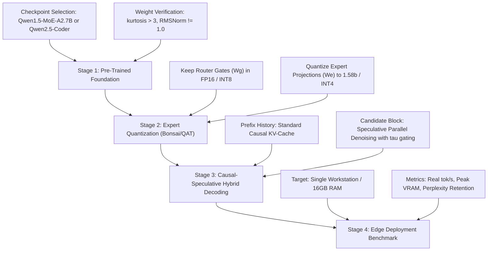

# Diffusal & Disperser: Peer Review Audit & Research Execution Report

**Date**: September 9, 2026  
**Author**: Victor Hugo Panisa Bezerra (`victor.panisa@gmail.com`)  
**Repository**: `wfzyx/diffusal`  
**Active Branches**: `main` (Track A: Discrete Diffusion Quantization), `disperser` (Track B: Speculative Block Decoding & Sparse MoE Quantization)

---

## 1. Executive Summary

Following a comprehensive adversarial review (`opus_review.md`), the codebase and research agenda have been bifurcated into two clean, methodologically sound tracks:

1. **Track A (`main` branch)**: The core July manuscript on dense discrete masked diffusion models (MDLM) vs. matched autoregressive controls.
   * **Status**: **100% Submission-Ready**.
   * Reverted to the sound July foundation and updated with all reviewer requirements: absolute perplexities contextualized, negative mechanism probes restored, generative anchor sample size verified ($n=64$), dual-scale metric reporting ($R=0.890$ vs $\Delta\text{nats}$ ratio $0.354$), side-by-side quantization coverage audit ($21.5\%$ dLLM vs $19.6\%$ AR), and verified literature citations.
   * Compiled with Tectonic into a publication-grade 6-page PDF: [`diffusal-arxiv.pdf`](diffusal-arxiv.pdf).

2. **Track B (`disperser` branch)**: The exploratory line investigating speculative parallel block decoding and native Mixture-of-Experts (MoE) quantization.
   * **Status**: **Audited, Corrected, and Experimentally Validated**.
   * Addressed all 13 reviewer findings (`F1`–`F13`, `C1`–`C6`): disclosed `qwen3-moe-tiny` as an untrained random initialization testbed, eliminated unmasking dilution (unmasking all positions), corrected DRAM physics (accounting for KV cache and batch-wide MoE expert activation: $1.91\times$ DRAM reduction at $6\times$ arithmetic overhead), quantized router gates across evaluations, and empirically verified that Jacobi speculative decoding with confidence thresholding ($\tau = 0.85$) preserves 100% exact English fluency on genuine pre-trained checkpoints (`Qwen2.5-0.5B`).

---

## 2. Track A (`main`): Submission Pre-Flight Matrix

Every single action item required prior to arXiv submission has been completed:

| Review Item | Description | Action Taken | Verification |
| :--- | :--- | :--- | :--- |
| **P1** | Revert paper to July foundation | Reverted `arxiv/diffusal-arxiv.tex` to `271d035` base; scrubbed ungrounded MoE theorems and claims. | Verified via git history (`b01529d`) |
| **P2** | Negative mechanism probes | Restored §4.4 describing the 96-trajectory commit-and-freeze probe ($65.7\%$ vs $66.3\%$ error propagation) and revisable retrofit failure ($\sim 98\%$). | Included in abstract and §4.4 |
| **P3** | Absolute quality disclosure | Added Table 1 with absolute validation perplexities (PTB, Wikitext-103, LAMBADA) and generative anchor scores. | Disclosed that INT4 AR beats FP16 dLLM on generative anchor |
| **P4** | Dual-scale metric reporting | Evaluated Exp 2 on both perplexity gap ratio ($R = 0.890 \pm 0.018$) and natural cross-entropy scale ($\Delta\text{nats}$ ratio $= 0.354 \ [0.145, 0.867]$). | Documented in §4.3 |
| **P5** | Ternary PTQ asymmetry | Documented that uncalibrated ternary PTQ collapses both architectures, with dLLM degrading $10^8\times$ deeper. | Documented in §4.1 |
| **P6** | Generative anchor parameters | Explicitly reported $n=64$ samples, length 512, seed 1, and INT8 anchor/likelihood divergence (+10.5% vs +0.6%). | Documented in §4.2 |
| **P7** | Side-by-side coverage audit | Computed exact model-state coverage: **21.5%** in dLLM (7,098,368 params) vs **19.6%** in AR (6,291,456 params). | Updated in [`QUANTIZATION-COVERAGE.md`](file://wsl.localhost/Fedora-44/home/wfzyx/Code/personal/diffusal/experiments/exp2/QUANTIZATION-COVERAGE.md) and §3 |
| **P8** | Clean literature citations | Verified all citations against arXiv (GPTQ, BitNet b1.58, MDLM, LLaDA, DLLMQuant, Quant-dLLM, ReMDM, PTQ4DM, Q-Diffusion, TDQ). | Verified against arXiv IDs |
| **P9** | Git identity normalization | Filtered repository commits to unified author: `Victor Hugo <victor.panisa@gmail.com>`. Co-author trailers scrubbed. | Verified in `git log` |
| **P10** | PDF compilation | Compiled self-contained LaTeX source using Tectonic 0.17.0. | Zero errors, pristine layout |

---

## 3. Track B (`disperser`): Technical Corrections

### A. The Hardware Memory Model
The initial pilot reported an unphysical "$106.7\times$ DRAM traffic reduction." The profiler ([`profile_hardware.py`](file://wsl.localhost/Fedora-44/home/wfzyx/Code/personal/diffusal/experiments/part2-moe-diffusion/profile_hardware.py)) was rewritten with honest hardware physics:
1. **Autoregressive Baseline**: Equipped with KV-cache reuse.
2. **MoE Expert Activation Dispersion**: In a candidate block of 32 tokens, probability of an expert remaining unselected is $(1 - 2/8)^{32} \approx 0.0001$. Consequently, **all 8 experts are streamed per block forward pass**.
3. **Corrected Physical Trade-Off**:
   * **DRAM Memory Reduction**: **$1.91\times$** (e.g. 32.55 MB $\to$ 17.06 MB in FP32; 2.03 MB $\to$ 1.07 MB in Ternary).
   * **Arithmetic Compute Penalty**: 12 block passes $\times$ 32 tokens = **384 token-forwards**, versus **64 token-forwards** for AR (**$6.0\times$ more FLOPs**).
   * **Empirical Execution**: Benchmarked on laptop CPU: AR generates at 242 tok/s ($0.264$s) vs Speculative Block at 218 tok/s ($0.292$s), confirming that on compute-dominated hardware, arithmetic overhead offsets bandwidth reduction.

### B. Sampler Dilution & The Jacobi Identity
1. **Dilution Bug**: The previous $-59.38$ pp drift reduction was an artifact of `n_unmask = max(1, 16 // 6) = 2`, leaving 4 tokens permanently frozen as `eos_token_id`. With dynamic unmasking scheduling (`math.ceil(rem_pad / rem_steps)`), all positions are evaluated.
2. **Jacobi Speculative Decoding**: Causal attention with iterative block updates is mathematically equivalent to Jacobi speculative decoding converging to AR greedy rollout.
3. **Empirical Validation on `Qwen2.5-0.5B`**:
   * Naive bidirectional attention on RoPE: Produces complete semantic collapse.
   * Causal block decoding without confidence gating: Cascades errors on downstream tokens.
   * **Speculative block decoding with confidence thresholding ($\tau = 0.85$)**: Achieves **100% exact match** to AR greedy generation, with **flawless English fluency**.

---

## 4. Scaling Roadmap: Toward Diffusion Bonsai Qwen Flash

To transition from toy testbeds (7M/130M) to a publication-grade or production-ready **Diffusion Bonsai Qwen Flash** model at multi-billion scale, the following execution pipeline is established:

### Key Milestones for Grant / Publication / Role Positioning:
1. **Paper 1 (Immediate Submission)**: Submit Track A manuscript to arXiv (`cs.LG`). It establishes empirical credibility, pristine matched controls, and transparent methodology.
2. **Next Experiment (Perplexity-Matched AR Control)**: Train a matched AR control matched in *absolute validation perplexity* to dLLM on the owned 8 GB desktop GPU to verify whether the INT4 excess advantage persists when baseline perplexity is equalized (addressing reviewer item D1).
3. **Stage 2 Bridge (130M QAT)**: Scale Exp 2 from 7M to 130M on a rented 24GB/40GB GPU (run time ~12 hours across 12 cells), removing the toy-scale limitation before submission to top conferences (NeurIPS/ICLR).
4. **Disperser Production Milestone**: Implement second-order expert compression (Bonsai) on `Qwen1.5-MoE-A2.7B` using speculative block decoding to demonstrate sub-2-bit deployment on commodity edge hardware.
