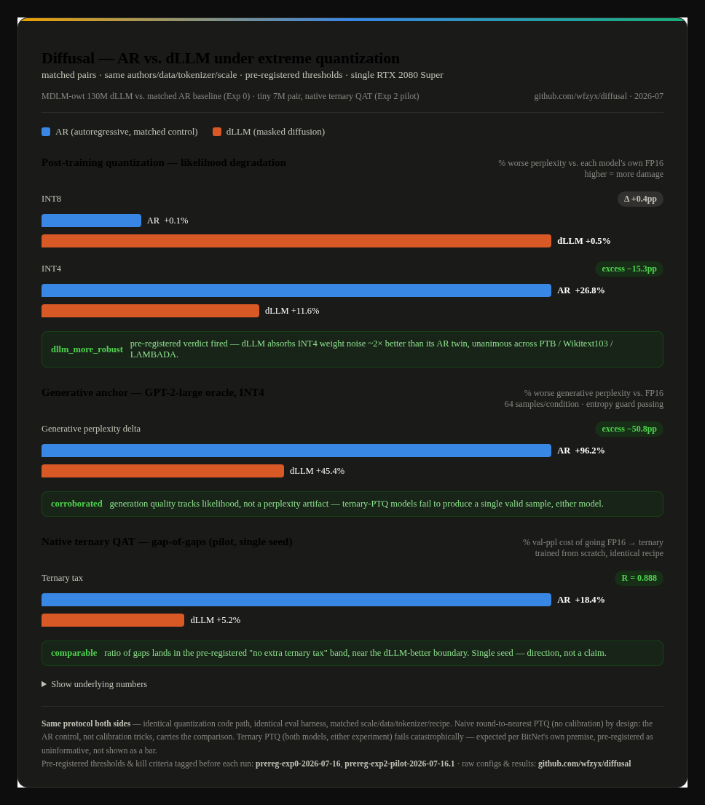

# Diffusal

**Do diffusion LLMs tolerate extreme weight quantization better than autoregressive LLMs?**
Measured on matched pairs — same authors, data, tokenizer, scale, recipe — with
pre-registered thresholds ([timestamped](https://github.com/wfzyx/diffusal/releases)
*before* each run). All experiments on a single RTX 2080 Super (8 GB).

## Results so far

**Exp 0 — post-training quantization, likelihood** (dLLM: MDLM-owt 130M vs its
matched AR baseline; damage relative to each model's own FP16):

| precision | AR degradation | dLLM degradation | excess (dLLM − AR) |
|---|---:|---:|---:|
| INT8 | ~0% | +0.3–0.6% | ≤ +0.7 pp |
| INT4 | +25–32% | +9–21% | **−11 to −16 pp** |
| ternary | ~10⁴× fp16 | ~10¹²× fp16 | uninformative (pre-registered) |

→ Pre-registered **`dllm_more_robust`** verdict fired: the diffusion model
absorbs INT4 weight noise roughly **2× better** than its AR twin, unanimous
across PTB / Wikitext103 / LAMBADA.

**Exp 0 — generative anchor** (64 samples/condition, GPT-2-large oracle,
entropy guard passing): INT4 costs the AR model **+96%** generative perplexity
vs **+45%** for the dLLM. Ternary-PTQ models fail to produce a single valid
sample. Corroborates the likelihood result — not a perplexity artifact.

**Exp 2 pilot — native ternary QAT** (4 matched tiny models trained from
scratch, BitNet-style STE, identical recipe, single seed):

| model | fp16 val ppl | ternary val ppl | ternary tax |
|---|---:|---:|---:|
| AR | 50.77 | 60.12 | **+18.4%** |
| dLLM | 97.97 | 103.05 | **+5.2%** |

→ Ratio of gaps **R = 0.888**: pre-registered **`comparable`** verdict
(diffusion pays no extra ternary tax), near the `dllm_better` boundary.
Single seed — a direction, not a claim.

Details, caveats, and raw numbers: [experiments/exp0/RESULTS.md](experiments/exp0/RESULTS.md),
[experiments/exp2/RESULTS-pilot.md](experiments/exp2/RESULTS-pilot.md).

## Why this might happen

Token commitment in masked diffusion is itself a quantizer: a logit
perturbation smaller than the gap to the runner-up token vanishes entirely at
argmax time. Iterative refinement may absorb sub-threshold quantization noise
that an autoregressive model must carry forward. The next experiment (Exp 1)
measures this directly: inject controlled perturbations mid-generation and
track whether the dynamics contracts or amplifies them, as a function of mask
fraction, under genuine remasking (ReMDM) vs commit-and-freeze sampling.

## The program

Measurement-then-build, defined in the
[whitepaper](whitepaper/diffusal-whitepaper.pdf) ([LaTeX](whitepaper/diffusal-whitepaper.tex))
and [THESIS.md](THESIS.md):

1. **Exp 0 (done):** PTQ degradation with matched AR controls — the *excess*
   is the only admissible evidence about diffusion.
2. **Exp 1 (next):** error-trajectory dynamics — per-step distortion vs
   feedback amplification, decomposed via teacher-forced / free-running /
   perturbation-injection protocols.
3. **Exp 2 (pilot done):** native ternary QAT with matched AR controls — the
   go/no-go is the gap-of-gaps, not absolute wins. End goal: a natively
   ternary (1.58-bit) masked diffusion model via AR-to-diffusion conversion
   at ~2–3B, where BitNet says ternary reaches parity.

Every experiment carries pre-registered thresholds and kill criteria
([configs/](configs/)), frozen and tagged before runs; amendments are new
tagged commits with justification.

## What this is not

Not "a 25B ternary dLLM in 6 GB" — activations, logits, and buffers dominate
at small scale (measured: the fp32 logits buffer, not weights, is what OOMs
an 8 GB card). Not a claim about 7B+ models. Not calibrated PTQ — naive RTN
by design, so the AR control carries the comparison.

## Reproduce

`experiments/exp0/` (PTQ grid + generative anchors) and `experiments/exp2/`
(QAT pilot) contain drivers, sanity tests, and resumable grid scripts; both
run against pinned [bd3lms](https://github.com/kuleshov-group/bd3lms) with an
sm75 flash-attn→SDPA shim (`experiments/exp0/shim/`, numerically validated).
See `experiments/exp0/PREP.md` for the full bring-up log, including why
zero-shot numbers must be reproduced through bd3lms (`insert_valid_eos=False`,
per [mdlm#22](https://github.com/kuleshov-group/mdlm/issues/22)).

## Non-obvious facts already established

- LLaDA/Dream "low-confidence remasking" is commit-and-freeze: committed
  tokens are frozen forever. True remasking needs ReMDM-style retrofits.
- The MDLM release ships a matched AR baseline — the confound-free control
  comes for free; its published zero-shot numbers reproduce only under the
  bd3lms eval protocol.
- Ternary PTQ fails on every architecture (BitNet's premise) — only *native*
  ternary training is informative, and no dLLM QAT existed in the literature
  as of 2026-07 (verified sweep in whitepaper §2).
