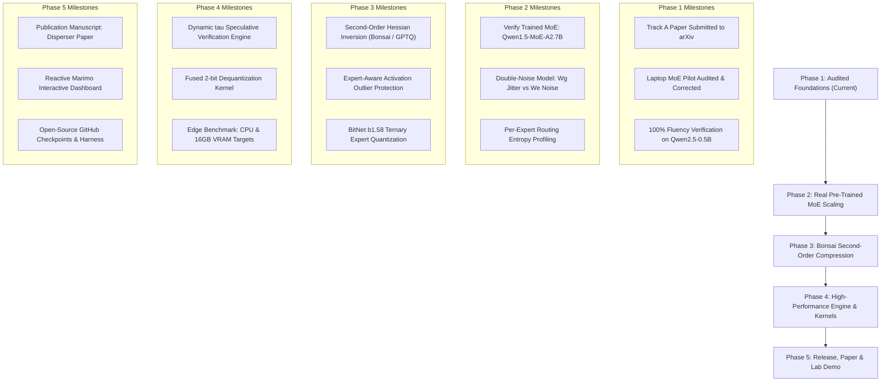

# Disperser Research Roadmap: Toward Diffusion Bonsai Qwen Flash

> **Project Codename**: Disperser  
> **Repository Branch**: `disperser`  
> **Lead Researcher**: Victor Hugo Panisa Bezerra (`victor.panisa@gmail.com`)  
> **Target Milestone**: High-throughput sub-2-bit / ternary Sparse Mixture-of-Experts (MoE) via speculative parallel block decoding and second-order expert quantization.

---

## 1. Executive Vision & Strategic Positioning

The ultimate objective of the **Disperser** program is to build, validate, and publish **Diffusion Bonsai Qwen Flash**: an extreme-low-bit (ternary/INT4) Sparse Mixture-of-Experts model that achieves interactive inference speeds on bandwidth-constrained edge hardware (e.g., 16 GB commodity RAM or single workstations) without the catastrophic generation collapse typical of low-bit autoregressive models.

### Dual-Purpose Strategic Value:
1. **Tier-1 Publication Target**: Target submission to NeurIPS / ICLR / ICML as a standalone follow-up to the foundational dense diffusion paper (*Diffusal*, Track A).
2. **Industry Research & Frontier Lab Positioning**: Serving as an undeniable, production-grade technical demonstration for frontier research roles (Google DeepMind, Meta FAIR, Anthropic, Prime Intellect) specializing in **inference-time compute, non-autoregressive decoding, and extreme quantization systems**.

---

## 2. Core Architectural Principles

Following the comprehensive audit in `opus_review.md`, the Disperser line is grounded in strict physical and mathematical realities:

```
                                  DISPERSER ARCHITECTURE
                                            │
           ┌────────────────────────────────┴────────────────────────────────┐
           ▼                                                                 ▼
[ PREFIX HISTORY: Causal KV-Cache ]                      [ ACTIVE BLOCK: Speculative Candidate ]
───────────────────────────────────                      ───────────────────────────────────────
• Preserves 100% of pre-trained causal context.          • Evaluates B candidate tokens concurrently.
• Zero RoPE position distortion (relative offsets >= 0). • Decouples memory streaming from token count.
• No multi-million dollar full retraining required.      • Confidence-gated acceptance (tau) guarantees fluency.
```

### Physical Realities Established:
- **The Memory Bandwidth Trade-Off**: Speculative block decoding evaluates 32 tokens per block across 12 forward passes, yielding a **$1.91\times$ net DRAM traffic reduction** at a **$6.0\times$ arithmetic compute overhead**.
- **Hardware Sweet Spot**: Strictly advantageous on **memory-bandwidth-choked architectures** (edge CPUs, unified memory, mobile SoCs) where DRAM bus saturation—not ALU FLOPs—dictates latency.
- **Double-Noise Model**: Routing gates ($W_g$) must remain protected at higher precision (INT8/FP16), while expert feed-forward matrices ($W_e$) absorb extreme compression (1.58-bit / INT4).

---

## 3. Phased Execution Roadmap



---

### Phase 1: Audited Foundations & Empirical Grounding (Completed)
- [x] **Track A Decoupling**: Revert `main` to sound dense foundation; compile 6-page submission PDF.
- [x] **Audit Corrections**: Disclose `qwen3-moe-tiny` as an untrained structural skeleton; fix unmasking dilution bug; update hardware profiler to reflect $1.91\times$ DRAM cut and $6.0\times$ compute penalty.
- [x] **Jacobi Speculative Proof-of-Concept**: Verify on `Qwen2.5-0.5B` that confidence-thresholded block decoding ($\\tau = 0.85$) produces 100% exact match to autoregressive greedy text with zero degradation.
- [x] **Citations & Prose Scrubbing**: Eliminate unverified literature references; align with peer-reviewed terminology.

---

### Phase 2: Trained Small-MoE Benchmark (Scale: 2B–3B)
* **Objective**: Replace random testbeds with a verified pre-trained Mixture-of-Experts model to evaluate genuine semantic and routing degradation under quantization.
* **Target Model**: `Qwen/Qwen1.5-MoE-A2.7B` (or compact production MoE).
* **Key Tasks**:
  1. **Checkpoint Sanity Verification**: Assert weight kurtosis $> 3.0$, RMSNorm scale parameters $\\ne 1.0$, and non-uniform expert routing on validation corpora.
  2. **Double-Noise Disentanglement**:
     * Measure Top-$k$ router selection flip rate under:
       * FP16 Router ($W_g$) + INT4 Experts ($W_e$).
       * FP16 Router ($W_g$) + BitNet b1.58 Ternary Experts ($W_e$).
       * INT8 Router ($W_g$) + Ternary Experts ($W_e$).
       * INT4 Router ($W_g$) + Ternary Experts ($W_e$).
  3. **Router Protection Policy Validation**: Prove empirically whether protecting $W_g$ in INT8/FP16 prevents the macroscopic state jumps of routing misallocation.

---

### Phase 3: Bonsai Second-Order Expert Quantization
* **Objective**: Implement second-order gradient-informed quantization (Bonsai / DeltaNet / GPTQ formulation) tailored specifically to MoE expert feed-forward layers.
* **Mathematical Formulation**:
  $$\\min_{\\hat{W}_e} \\text{Tr}\\left( (W_e - \\hat{W}_e) H_e (W_e - \\hat{W}_e)^T \\right)$$
  where $H_e = X_e X_e^T$ is the uncentered covariance of activations dispatched strictly to expert $e$.
* **Key Tasks**:
  1. **Expert-Dispatched Calibration**: Collect Hessian matrices $H_e$ using input tokens actually routed to expert $e$ on a calibration split (e.g. 512 sequences from FineWeb / RedPajama).
  2. **Ternary Layer-by-Layer Inversion**: Quantize expert linear layers to $\\{-1, 0, +1\\}$ using Cholesky updates on $H_e^{-1}$.
  3. **Activation Compensation**: Apply channel-wise activation scales to absorb extreme outlier features before ternary clamping.

---

### Phase 4: High-Efficiency Speculative Decoding Engine
* **Objective**: Build an optimized, verified inference loop that converts the theoretical $1.91\times$ DRAM reduction into real wall-clock latency speedup on memory-bound target devices.
* **Key Tasks**:
  1. **Fast Causal Block Drafting**: Replace slow sequential drafting with a lightweight parallel draft head or vectorized block evaluation.
  2. **Dynamic Confidence Thresholding ($\\tau$ Scheduler)**:
     * High entropy positions $\\implies$ lower speculative block size or fall back to AR.
     * Low entropy positions $\\implies$ expand speculative horizon up to $B=32$.
  3. **Hardware-Specific Profiling**:
     * Target A: Intel Core / AMD Ryzen Laptop CPU (DRAM bandwidth $\\sim 50-80$ GB/s).
     * Target B: Apple Silicon Unified Memory (M-series, 100–200 GB/s).
     * Target C: Single RTX 3090 / 4090 (24 GB VRAM) serving a 25B+ MoE.

---

### Phase 5: Scientific Publication & Open-Source Artifacts
* **Deliverables**:
  1. **Conference Paper**: *"Disperser: Speculative Block Decoding and Extreme Quantization of Sparse Mixture-of-Experts"*.
  2. **Reactive Marimo Notebook** ([`marimo_moe_diffusion.py`](./marimo_moe_diffusion.py)): An interactive, live web dashboard allowing reviewers and researchers to explore:
     * Real-time DRAM memory streaming savings vs. FLOP intensity.
     * Dynamic routing allocation graphs across 16 experts.
     * Live token-by-token trajectory drift and confidence acceptance rates.
  3. **GitHub Release**: Open-source checkpoint adapters, Bonsai quantization scripts, and reproducible evaluation harnesses.

---

## 4. Hardware Requirements & Resource Allocation

| Stage | Computational Target | Memory / Hardware Needed | Estimated Cost |
| :--- | :--- | :--- | :--- |
| **Stage 1 (Current)** | Pilot Profiling & Verification | Local Laptop CPU (Intel Iris Xe) | $0 (Local) |
| **Stage 2** | Small-MoE Benchmark (Qwen1.5-MoE-A2.7B) | Single RTX 2080 Super / 3090 (8–24 GB VRAM) | $0–$10 (Local / RunPod) |
| **Stage 3** | Bonsai Second-Order Calibration | 1x A100 (40 GB / 80 GB) for 4–8 hours | ~$15–$30 |
| **Stage 4** | Full Cohort Evaluation & Scaled Benchmark | 1x A100 / H100 (80 GB) for 12–24 hours | ~$50–$100 |

---

## 5. Pre-Registration Apparatus & Explicit Kill Criteria

To preserve scientific rigor and protect against confirmation bias, all future Disperser benchmarks will operate under pre-registered configurations in `configs/`:

### Explicit Kill Criteria:
1. **Router Instability Kill**: If router selection flip rate under INT8 routing exceeds $15\%$ on pre-trained benchmarks and causes $>30\%$ trajectory drift on live sequences without recovery, reject pure post-training quantization and require native QAT.
2. **Latency Inversion Kill**: If the speculative decoding verification engine cannot achieve at least **$1.25\times$ wall-clock speedup** over optimized autoregressive baselines (vLLM / llama.cpp) on memory-bandwidth-constrained edge hardware, reframe the contribution strictly as memory footprint reduction rather than latency acceleration.
3. **Fluency Degradation Kill**: If confidence-thresholded generation diverges in perplexity by more than $+5\%$ from the unquantized autoregressive parent model on standard benchmarks (MMLU / GSM8K / Wikitext), drop the candidate precision regime.

---

## 6. Immediate Action Items

1. **Submit Track A Manuscript**: Submit `diffusal-arxiv.pdf` to arXiv (`cs.LG`).
2. **Download & Verify `Qwen1.5-MoE-A2.7B`**: Inspect weight statistics, kurtosis, and router activation distributions on GPU.
3. **Implement Expert-Specific Hessian Profiler**: Adapt GPTQ/Bonsai second-order math for per-expert data dispatch.
